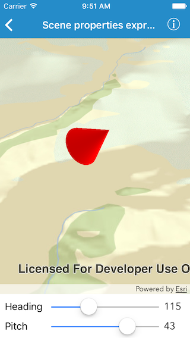

#Surface placements

This sample demonstrates how to update the orientation of graphics in graphics overlay using expressions on scene properties.

##How to use the sample

Move the `Heading` and `Pitch` sliders to change the orientation of graphics in the graphics overlay.

##How it works

The sample creates an `AGSSimpleRenderer` object for graphics overlay. On the renderer the `sceneProperties.headingExpression` and `sceneProperties.pitchExpression` properties are set to the attribute names, on the graphics, used to change the values for heading and pitch. Each slider affects the value of respective attribute, which in turn affects the orientation of the graphics via the renderer.
