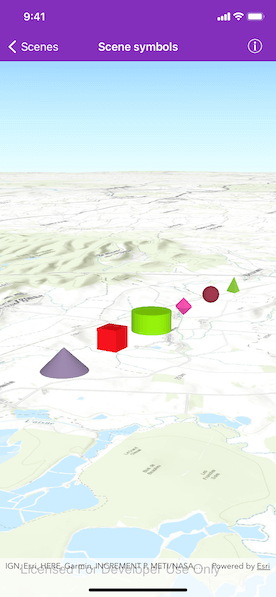

# Scene symbols

Show various kinds of 3D symbols in a scene.

## Use case

You can programmatically create different types of 3D symbols and add them to a scene at specified locations. You could do this to call attention to the prominence of a location.

## How to use the sample

When the scene loads, note the different types of 3D symbols that you can create. Pan and zoom to observe the symbols.

## How it works

1. Create an `AGSScene` and an `AGSSurface`.
2. Add an `AGSArcGISTiledElevationSource` to the surface and apply it to the scene.
3. Create an `AGSGraphicsOverlay`.
4. Create various `AGSSimpleMarkerSceneSymbol`s by specifying different styles and colors, and a height, width, depth, and anchor position of each.
5. Create an `AGSGraphic` for each symbol.
6. Add the graphics to the graphics overlay.
7. Add the graphics overlay to the scene view.

## Relevant API

* AGSGraphic
* AGSGraphicsOverlay
* AGSScene
* AGSSimpleMarkerSceneSymbol

## About the data

This sample shows arbitrary symbols in an empty scene with imagery basemap.

## Tags

3D, cone, cube, cylinder, diamond, geometry, graphic, graphics overlay, pyramid, scene, shape, sphere, symbol, tetrahedron, tube, visualization
