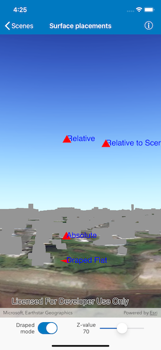

# Surface placements

Position graphics relative to a surface using different surface placement modes.

## Use case

Depending on the use case, data might be displayed at an absolute height (e.g. flight data recorded with altitude information), at a relative height to the terrain (e.g. transmission lines positioned relative to the ground), at a relative height to objects in the scene (e.g. extruded polygons, integrated mesh scene layer), or draped directly onto the terrain (e.g. location markers, area boundaries).

## How to use the sample

The sample loads a scene showing four points that use the individual surface placement rules (absolute, relative, and draped billboarded). Explore the scene by zooming in/out and by panning around to observe the effects of the surface placement rules.

## How it works

1. Create an `AGSGraphicsOverlay` for each placement mode, specifying the `surfacePlacement`: 
    * `absolute`, position graphic using only its Z value.
    * `relative`, position graphic using its Z value plus the elevation of the surface.
    * `drapedBillboarded`, position graphic upright on the surface and always facing the camera, not using its z value.
2. Add graphics to the graphics overlay using the  `addObjects(from:)` method.
3. Add each graphics overlay to the scene view.

## Relevant API

* AGSGraphic
* AGSGraphicsOverlay
* AGSSurfacePlacement
* AGSLayerSceneProperties
* AGSSurface

## About the data

The scene launches with a view of Wales. Four points are shown hovering with positions defined by each of the different surface placement modes.

## Additional information

This sample uses an elevation service to add elevation/terrain to the scene. Graphics are positioned relative to that surface for the `drapedBillboarded` and `relative` surface placement modes.

## Tags

3D, absolute, altitude, draped, elevation, floating, relative, scenes, sea level, surface placement
