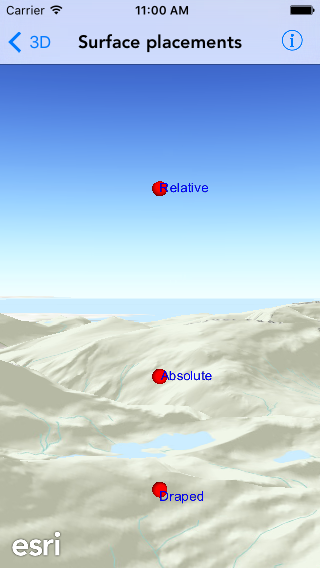

# Surface placements

This sample demonstrates how to position graphics using different surface placements

## How it works

The sample creates three graphic overlays. For each graphic overlay it set the `sceneProperties.surfacePlacement` property to one of the following:

- Draped (on the surface)
- Relative (height above the surface)
- Absolute (height above sea level)

It then creates two graphics, one using a sphere marker scene symbol and other using text symbol, and adds to each graphic overlay to show the difference in the placements.
