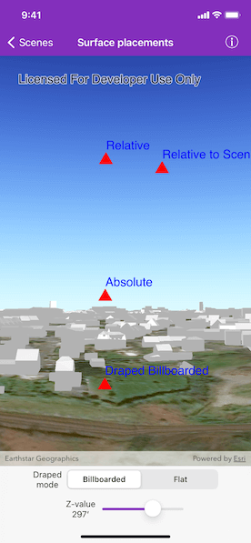

# Surface placements

Position graphics relative to a surface using different surface placement modes.

## Use case

Depending on the use case, data might be displayed at an absolute height (e.g. flight data recorded with altitude information), at a relative height to the terrain (e.g. transmission lines positioned relative to the ground), at a relative height to objects in the scene (e.g. extruded polygons, integrated mesh scene layer), or draped directly onto the terrain (e.g. location markers, area boundaries).

## How to use the sample

The sample loads a scene showing four points that use the individual surface placement rules (absolute, relative, relative to scene, and either draped billboarded or draped flat). Use the toggle to change the draped mode and the slider to dynamically adjust the z value of the graphics. Explore the scene by zooming in/out and by panning around to observe the effects of the surface placement rules.

## How it works

1. Create an `AGSGraphicsOverlay` for each placement mode, specifying the `surfacePlacement`:
    * `absolute`, position graphic using only its z value.
    * `relative`, position graphic using its z value plus the elevation of the surface.
    * `relativeToScene`, position graphic using its z value plus the altitude values of the scene.
    * `drapedBillboarded`, position graphic upright on the surface and always facing the camera, not using its z value.
    * `drapedFlat`, position graphic flat on the surface, not using its z value.
2. Add graphics to the graphics overlay's `graphics` array.
3. Add each graphics overlay to the scene view.

## Relevant API

* AGSGraphic
* AGSGraphicsOverlay
* AGSLayerSceneProperties
* AGSSurface
* AGSSurfacePlacement
* class AGSGeometryEngine.geometry(bySettingZ:in:)

## About the data

The scene shows a view of Brest, France. Four points are shown hovering with positions defined by each of the different surface placement modes (absolute, relative, relative to scene, and either draped billboarded or draped flat).

## Additional information

This sample uses an elevation service to add elevation/terrain to the scene. Graphics are positioned relative to that surface for the `drapedBillboarded`, `drapedFlat`, and `relative` surface placement modes. It also uses a scene layer containing 3D models of buildings. Graphics are positioned relative to that scene layer for the `relativeToScene` surface placement mode.

## Tags

3D, absolute, altitude, draped, elevation, floating, relative, scenes, sea level, surface placement
