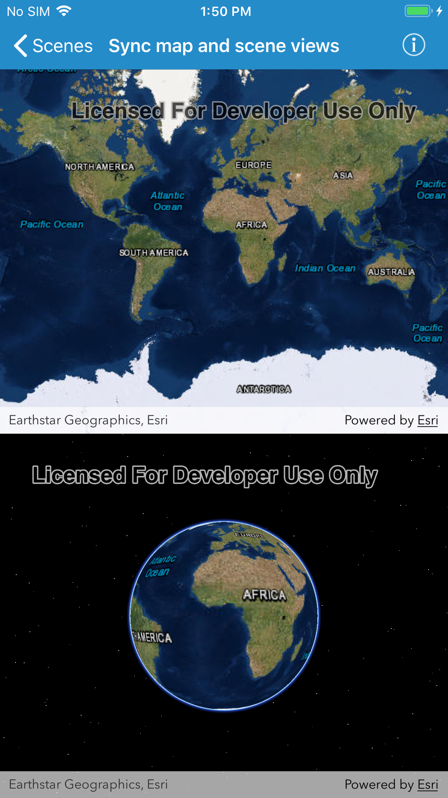

# Sync map and scene views

This sample demonstrates how to keep the viewpoints of multiple map or scene views in sync, so that navigating one view immediately updates the others.

## How to use the sample

Pan, zoom, and rotate the map or scene view. The other view will update automatically to match your navigation. Note that maps are 2D while scenes are 3D, so the results may not look identical, but the centers and scales will be kept the same.

## How it works

`AGSGeoView`, the common ancestor class of both `AGSMapView` and `AGSSceneView`, has a property `viewpointChangeHandler`. This is a closure called each time the viewpoint updates. Inside this closure we get the viewpoint of the sender by calling `currentViewpoint(with:)` with `AGSViewPointType.centerAndScale`. We then pass that viewpoint into `setViewpoint(_:)` on the other view, thus synchronizing all the views.

## Relevant API

- `AGSGeoView`
- `AGSGeoView.viewpointChangeHandler`
- `AGSGeoView.isNavigating`
- `AGSGeoView.currentViewpoint(with:)`
- `AGSGeoView.setViewpoint(_:)`

## Tags

maps, scenes, viewpoints, synchronization