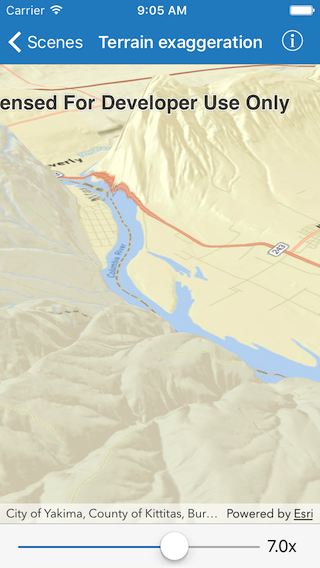

# Terrain exaggeration

This sample demonstrates how to use terrain exaggeration on a surface in a scene.

## How it works

The sample uses an `AGSArcGISTiledElevationSource` as the elevation source for an `AGSSurface`; the surface is set as the `baseSurface` on the scene.  When a value is set on the surface `elevationExaggeration` property, the basemap layer displays the exaggeration.
