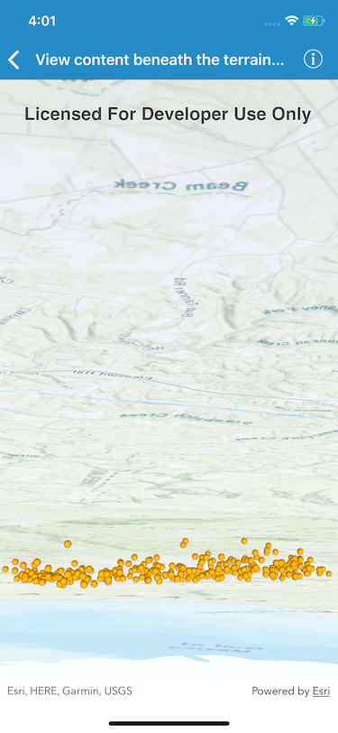

# View content beneath the terrain surface

See through terrain in a scene and move the camera underground.

## Use case

By default, a scene's terrain is fully opaque and the camera cannot go underground. To see underground features such as pipes in a utility network, you can lower the opacity of the terrain surface and set the navigation constraint on the surface to allow underground navigation.

## How it works

1. Display an `AGSScene` in an `AGSSceneView` which contains layers with underground features.
2. To see underground, get the scene's base surface and set its opacity to a value between 0 and 1.
2. To allow the camera to go underground, set the surface's navigation constraint to `none`.

## Relevant API

- `AGSSurface`
- `AGSSurface.navigationConstraint`

## Tags

3D, subsurface, underground, utilities