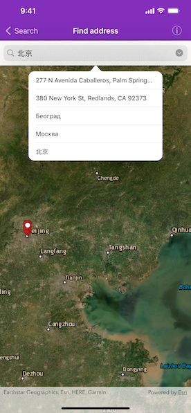

# Find address

Find the location for an address.

## Use case

A user can input a raw address into your app's search bar and zoom to the address location.

## How to use the sample

For simplicity, the sample comes loaded with a set of suggested addresses. Choose an address from the suggestions or submit your own address to show its location on the map in a callout. Tap the pin to display the address on the map

## How it works

1. Create an `AGSLocatorTask` using the URL to a locator service.
2. Set the `AGSGeocodeParameters` for the locator task and specify the geocode's attributes.
3. Get the matching results from the `AGSGeocodeResult` using `AGSLocatorTask.geocode(with:parameters:completion)`.
4. Create an `AGSGraphic` with the geocode result's location and store the geocode result's attributes in the graphic's attributes.
5. Show the graphic in an `AGSGraphicsOverlay`.

## Relevant API

* AGSGeocodeParameters
* AGSGeocodeResult
* AGSLocatorTask

## Tags

address, geocode, locator, search
