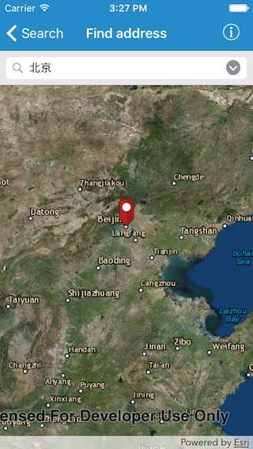

#Find address

This sample demonstrates how to geocode an address and show it on the map view

##How to use the sample

You can either type in an address or choose an address from the list to show it on the map view. The address location is marked with a pin. You can tap on the pin to show the address in a callout.

##How it works

The sample uses the `geocode(withSearchText:parameters:completion:)` method on the `AGSLocatorTask` to geocode an address. It returns an array of `AGSGeocodeResult` objects in case of success. The first result is displayed on the map view using `AGSGraphicsOverlay`. The attributes returned in the `AGSGeocodeResult` object are used as `title` and `detail` fields for the callout.  To show the callout the sample uses the `show(for:tapLocation:animated:)` method on `AGSCallout`.

