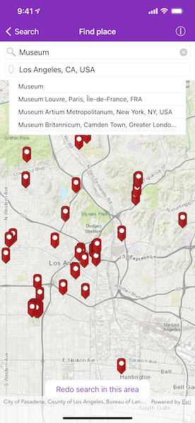
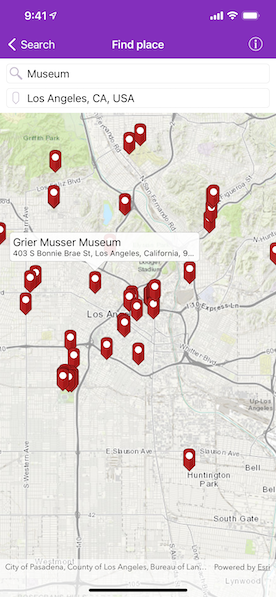

# Find place

Find places of interest near a location or within a specific area.

## Use case

When getting directions or looking for nearby places, users may only know what the place has ("food"), the type of place ("gym"), or the generic place name ("Starbucks"), rather than the specific address. You can get suggestions and locations for these places of interest (POIs) using a natural language query. Additionally, you can filter the results to a specific area.

## How to use the sample

Choose a type of place in the first field and an area to search within in the second field. Tap the Search button to show the results of the query on the map. Tap on a result pin to show its name and address. If you pan away from the result area, a "Redo search in this area" button will appear. tap it to query again for the currently viewed area on the map.

## How it works

1. Create an `AGSLocatorTask` using a URL to a locator service.
2. Find the location for an address (or city name) to search within:
    * Create `AGSGeocodeParameters`.
    * Add return fields to the parameters' `AGSGeocodeParameters.resultAttributeNames` collection. Only add a single "\*" option to return all fields.
    * Call `AGSLocatorTask.geocode(withSearchText:parameters:completion)` to get a list of `AGSGeocodeResult`s.
    * Use `AGSGeocodeResult.displayLocation` from one of the results to search within.
3. Get place of interest (POI) suggestions based on a place name query:
    * Create `AGSSuggestParameters`.
    * Add "POI" to the parameters' `categories` collection.
    * Call `AGSLocatorTask.suggest(withSearchText:parameters:completion)` to get a list of `AGSSuggestResult`.
    * The `AGSSuggestResult` will have a `label` to display in the search suggestions list.
4. Use one of the suggestions or a user-written query to find the locations of POIs:
    * Create `AGSGeocodeParameters`.
    * Set the parameters' `searchArea` to `AGSGeometry` of the area you want to search.
    * Call `AGSLocatorTask.geocodeA(withSearchText:parameters:completion)` to get a list of `GeocodeResult`s.
    * Display the places of interest using the results' `AGSGeocodeResult.displayLocation`s.

## About the data  

This sample uses the world locator service "https://geocode.arcgis.com/arcgis/rest/services/World/GeocodeServer".

## Relevant API

* AGSGeocodeParameters
* AGSGeocodeResult
* AGSLocatorTask
* AGSSuggestParameters
* AGSSuggestResult

## Tags

businesses, geocode, locations, locator, places of interest, POI, point of interest, search, suggestions

