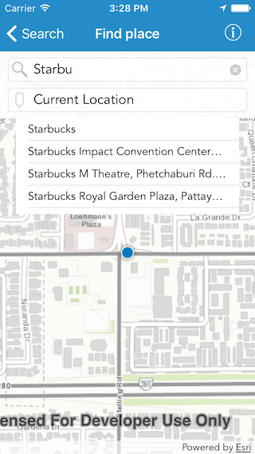
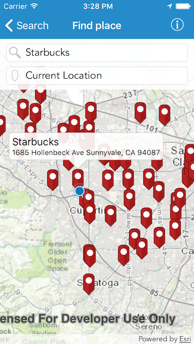

#Find place

This sample demonstrates how to use geocode functionality to search for points of interest, around a location or within an extent

##How to use the sample

Specify the point of interest in the `Point of Interest` textfield (e.g. Starbucks). For the proximity field you can choose between your current location, any other location or you can leave it blank for a generic search. As soon as you start typing into either of the textfields, the app gives you suggestions. When you hit the search button, the resulting locations are shown on the map. You can tap on a pin to get details about that location. You can also pan around and redo search in the new extent

##How it works

The sample uses the `suggest(withSearchText:parameters:completion:)` method on the `AGSLocatorTask` to get suggestions while you are typing. The suggestions for each textfield are restricted using `categories` on `AGSSuggestParameters`. If a proximity location is specified, the sample uses the `geocode(with:parameters:completion:)` method on locator task to find out the coordinates for that location. It then uses that location in the `AGSRouteParameters` as `preferredSearchLocation` and finds the POIs using `geocode(withSearchText:parameters:completion:)`, with the point of interest you entered as the text. When you tap on the `Redo search in this area` button, the same method is called but with different parameters. This time the `searchArea` parameter is set. 

