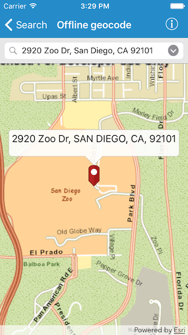

#Offline geocode

This sample demonstrates how you can geocode addresses to locations and reverse geocode locations to addresses even when the device does not have network connectivity 

##How to use the sample

To locate an address either type in or choose from the list of addresses. And to find an address for a point or location on the map tap and hold on the map. You can also tap hold and move to update location and get instant results

##How it works

The sample contains an address locator dataset (*.loc and associated files) that contains address information for downtown San Francisco. Geocoding and Reverse geocoding operations use this data. The sample displays basemap tiles using a tile package (.tpk file) so that the basemap is visible even when the device is offline.

