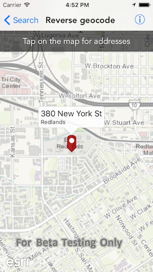

#Reverse geocode

This sample demonstrates how to get the address for a point on the map

##How to use the sample

Tap on a point on the map, a graphic will be added at that point and a callout will show the address for that point

##How it works

The sample uses the `reverseGeocode(withLocation:parameters:completion:)` method on `AGSLocatorTask` to find an address for a point. To show the callout the sample uses the `show(for:tapLocation:animated:)` method on `AGSCallout`.

