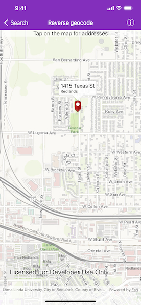

# Reverse geocode

Use an online service to find the address for a tapped point.

## Use case

You might use a geocoder to find a customer's delivery address based on the location returned by their device's GPS.

## How to use the sample

Tap the map to see the nearest address displayed in a callout.

## How it works

1. Create an `AGSLocatorTask` object using a URL to a geocoder service.
2. Set the `AGSGeocodeParameters` for the `AGSLocatorTask` and specify the geocoder's attributes.
3. Get the matching results from the `AGSGeocodeResult` using  `AGSLocatorTask.reverseGeocodeAsync`.
4. Show the results using a `AGSPictureMarkerSymbol` and add the symbol to a `AGSGraphic` in the `AGSGraphicsOverlay`.

## Relevant API

* AGSGeocodeParameters
* AGSLocatorTask
* AGSReverseGeocodeParameters

## Tags

address, geocode, locate, reverse geocode, search

