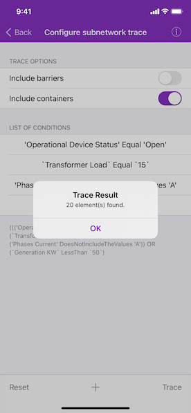

# Configure subnetwork trace

Get a server-defined trace configuration for a given tier and modify its traversability scope, add new condition barriers and control what is included in the subnetwork trace result.

## Use case

While some traces are built from an ad-hoc group of parameters, many are based on a variation of the trace configuration taken from the subnetwork definition. For example, an electrical trace will be based on the trace configuration of the subnetwork, but may add additional clauses to constrain the trace along a single phase. Similarly, a trace in a gas or electric design application may include features with a status of "In Design" that are normally excluded from trace results.

## How to use the sample

The sample loads with a server-defined trace configuration from a tier. Use the switches to toggle which options to include in the trace - such as containers or barriers. Select different attributes, comparison operators, and values. Then use "Add condition" to add it to the trace configuration. Tap "Trace" to run a subnetwork trace with this modified configuration from a default starting location.

Example barrier conditions for the default dataset:

* 'Transformer Load' equal '15'
* 'Phases Current' doesNotIncludeTheValues 'A'
* 'Generation KW' lessThan '50'

## How it works

1. Create and load an `AGSUtilityNetwork` with a feature service URL, then get an asset type and a tier by their names.
2. Populate the choice list for the comparison source with the non-system defined `AGSUtilityNetworkDefinition.networkAttributes`.  Populate the choice list for the comparison operator with the enum values from `AGSUtilityAttributeComparisonOperator`.
3. Create an `AGSUtilityElement` from this asset type to use as the starting location for the trace.
4. Update the selected barrier expression and the checked options in the UI using this tier's `AGSTraceConfiguration`.
5. When 'Network Attribute' is selected, if its `AGSDomain` is an `AGSCodedValueDomain`, populate the choice list for the comparison value with its `AGSCodedValues`.  Otherwise, display a `UITextField` for entering an attribute value.
6. When "Add condition" is tapped, create a new `AGSUtilityNetworkAttributeComparison` using the selected comparison source, operator, and selected or typed value. Use the selected source's `dataType` to convert the comparison value to the correct data type.
7. If the traversability's list of `barriers` is not empty, create an `AGSUtilityTraceOrCondition` with the existing `barriers` and the new comparison from step 6.
8. When "Trace" is tapped, create `AGSUtilityTraceParameters` passing in `subnetwork` and the default starting location.  Set its `traceConfiguration` with the modified options, selections, and expression; then trace the utility network with `AGSUtilityNetwork.trace(with:completion:)`.
9. When "Reset" is tapped, set the trace configurations expression back to its original value.
10. Display the count of returned `AGSUtilityElementTraceResult.elements`.

## Relevant API

* AGSCodedValueDomain
* AGSUtilityAssetType
* AGSUtilityAttributeComparisonOperator
* AGSUtilityCategory
* AGSUtilityCategoryComparison
* AGSUtilityCategoryComparisonOperator
* AGSUtilityDomainNetwork
* AGSUtilityElement
* AGSUtilityElementTraceResult
* AGSUtilityNetwork
* AGSUtilityNetworkAttribute
* AGSUtilityNetworkAttributeComparison
* AGSUtilityNetworkDefinition
* AGSUtilityTerminal
* AGSUtilityTier
* AGSUtilityTraceAndCondition
* AGSUtilityTraceConfiguration
* AGSUtilityTraceOrCondition
* AGSUtilityTraceParameters
* AGSUtilityTraceResult
* AGSUtilityTraceType
* AGSUtilityTraversability

## About the data

The [Naperville electrical](https://sampleserver7.arcgisonline.com/arcgis/rest/services/UtilityNetwork/NapervilleElectric/FeatureServer)  network feature service, hosted on ArcGIS Online, contains a utility network used to run the subnetwork-based trace shown in this sample.

## Tags

category comparison, condition barriers, network analysis, network attribute comparison, subnetwork trace, trace configuration, traversability, utility network, validate consistency
