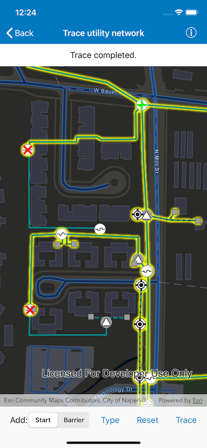

# Trace utility network

Discover connected features in a utility network using connected, subnetwork, upstream, and downstream traces.

## Use case

You can use a trace to visualize and validate the network topology of a utility network for quality assurance. Subnetwork traces are used for validating whether subnetworks, such as circuits or zones, are defined or edited appropriately.

## How to use the sample

Tap on one or more features while "Start" or "Barrier" is selected. When a junction feature is identified, you may be prompted to select a terminal. When an edge feature is identified, the distance from the tapped location to the beginning of the edge feature will be computed. Tap "Type" to select the type of trace using the action sheet. Tap "Trace" to initiate a trace on the network. Tap "Reset" to clear the trace parameters and start over.

## How it works

1. Create an `AGSMapView` and listen for `didTap` events on the `AGSGeoViewTouchDelegate`.
2. Create an `AGSMap` that contains `AGSFeatureLayer`(s) that are part of a utility network.
3. Create and load an `AGSUtilityNetwork` with the same feature service URL and map.
4. Add an `AGSGraphicsOverlay` with symbology that distinguishes starting locations from barriers.
5. Identify tapped features on the map and add an `AGSGraphic` that represents its purpose (starting point or barrier) at the tapped location.
6. Create an `AGSUtilityElement` for the identified feature.
7. Determine the type of the identified feature using `AGSUtilityNetwork.definition.networkSource.sourceType` passing its table name.
8. If the type is a `.junction`, display a terminal picker when more than one terminal is found and create an `AGSUtilityElement` using the selected terminal, or the single terminal if there is only one.
9. If the type is an `.edge`, create an `AGSUtilityElement` from the identified feature and compute how far along the edge the user tapped using `class AGSGeometryEngine.fraction(alongLine:to:tolerance:)`.
10. Add this `AGSUtilityElement` to a collection of starting locations or barriers.
11. Create `AGSUtilityTraceParameters` with the selected trace type along with the collected starting locations and barriers (if applicable).
12. Set the `AGSUtilityTraceConfiguration` with the utility tier's `traceConfiguration` property.
13. Run `AGSUtilityNetwork.trace(with:completion:)` with the specified starting points and (optionally) barriers.
14. Group the `AGSUtilityElementTraceResult.elements` by their `networkSource.name`.
15. For every `AGSFeatureLayer` in this map with trace result elements, select features by converting `AGSUtilityElement`(s) to `AGSArcGISFeature`(s) using `AGSUtilityNetwork.features(for:completion:)`

## Relevant API

* class AGSGeometryEngine.fraction(alongLine:to:tolerance:)
* AGSUtilityAssetType
* AGSUtilityDomainNetwork
* AGSUtilityElement
* AGSUtilityElementTraceResult
* AGSUtilityNetwork
* AGSUtilityNetworkDefinition
* AGSUtilityNetworkSource
* AGSUtilityTerminal
* AGSUtilityTier
* AGSUtilityTraceConfiguration
* AGSUtilityTraceParameters
* AGSUtilityTraceResult
* AGSUtilityTraceType
* AGSUtilityTraversability

## About the data

The [Naperville electrical](https://sampleserver7.arcgisonline.com/arcgis/rest/services/UtilityNetwork/NapervilleElectric/FeatureServer) network feature service, hosted on ArcGIS Online, contains a utility network used to run the subnetwork-based trace shown in this sample.

## Tags

condition barriers, downstream trace, network analysis, subnetwork trace, trace configuration, traversability, upstream trace, utility network, validate consistency
