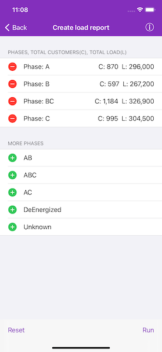

# Create load report

Create a simple electric distribution report that displays the count of customers and total load per phase by tracing downstream from a given point.

## Use case

You can use a load report to display the customers per phase as well as the load per phase based on a chosen starting point in a utility network. Load reports are used for electric load restoration and balancing.

## How to use the sample

Choose phases to be included in the report. Tap "Run" to initiate a downstream trace on the network and create a load report. Swipe to delete phases from the list. Tap "Reset" to clear the phases and start over.

## How it works

1. Create and load an `AGSUtilityNetwork` with a feature service URL, then get an asset type, tier, network attributes, and category by their names.
2. Create an `AGSUtilityElement` from the asset type to use as the starting location for the trace.
3. Get a base condition from the utility tier's trace configuration.
4. Create `AGSUtilityTraceParameters` passing in `downstream` trace type and the default starting location. Set its `traceConfiguration` property with the trace configuration above.
5. Create an `AGSUtilityCategoryComparison` where "ServicePoint" category exists.
6. Reset the `functions` property of the trace configuration with a new `AGSUtilityTraceFunction` adding a "Service Load" network attribute where this category comparison applies. This will limit the function results.
7. Set `outputCondition` with this category comparison to limit the element results.
8. Populate the choice list for phases using the network attribute's `codedValues` property.
9. When the "Add" button is tapped, add the selected phase to a phases list.
10. When the "Run" button is tapped, run a trace for every `AGSCodedValue` in the phases list. Do this by creating an `AGSUtilityTraceOrCondition` with the base condition and an `AGSUtilityNetworkAttributeComparison` where the "Phases Current" network attribute does not include the coded value.
11. Display the count of "Total Customers" using the `elements` property of the result, and the result of "Total Load" using the first and only output in `functionOutputs` property.

## Relevant API

* AGSUtilityAssetType
* AGSUtilityCategoryComparison
* AGSUtilityDomainNetwork
* AGSUtilityElement
* AGSUtilityElementTraceResult
* AGSUtilityNetwork
* AGSUtilityNetworkAttribute
* AGSUtilityNetworkAttributeComparison
* AGSUtilityNetworkDefinition
* AGSUtilityNetworkSource
* AGSUtilityTerminal
* AGSUtilityTier
* AGSUtilityTraceConfiguration
* AGSUtilityTraceFunction
* AGSUtilityTraceParameters
* AGSUtilityTraceResult
* AGSUtilityTraceType
* AGSUtilityTraversability

## About the data

The [Naperville electrical](https://sampleserver7.arcgisonline.com/arcgis/rest/services/UtilityNetwork/NapervilleElectric/FeatureServer) network feature service, hosted on ArcGIS Online, contains a utility network used to run the subnetwork-based trace shown in this sample.

## Additional information

Using utility network on ArcGIS Enterprise 10.8 requires an ArcGIS Enterprise member account licensed with the [Utility Network user type extension](https://enterprise.arcgis.com/en/portal/latest/administer/windows/license-user-type-extensions.htm#ESRI_SECTION1_41D78AD9691B42E0A8C227C113C0C0BF). Please refer to the [utility network services documentation](https://enterprise.arcgis.com/en/server/latest/publish-services/windows/utility-network-services.htm).

## Tags

condition barriers, downstream trace, network analysis, subnetwork trace, trace configuration, traversability, upstream trace, utility network, validate consistency
