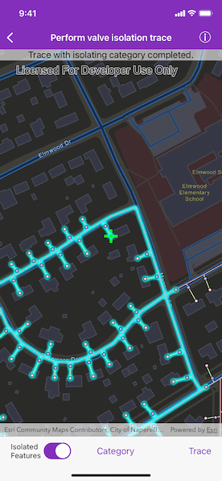

# Perform valve isolation trace

Run a filtered trace to locate operable features that will isolate an area from the flow of network resources.

## Use case

Determine the set of operable features required to stop a network's resource, effectively isolating an area of the network. For example, you can choose to return only accessible and operable valves: ones that are not paved over or rusted shut.

## How to use the sample

Tap "Category" to create and set the configuration's filter barriers with a utility category. Toggle "Isolated Features" to update trace configuration. Tap "Trace" to run a subnetwork-based isolation trace.

## How it works

1. Create an `AGSMapView` object.
2. Create and load an `AGSServiceGeodatabase` with a feature service URL and get tables with their layer IDs.
3. Create an `AGSMap` object that contains `AGSFeatureLayer`(s) created from the service geodatabase's tables.
4. Create and load an `AGSUtilityNetwork` with the same feature service URL and map.
5. Create a default starting location from a given asset type and global ID.
6. Add an `AGSGraphicsOverlay` with an `AGSGraphic` that represents this starting location.
7. Populate the choice list for the filter barriers from the `categories` property of `AGSUtilityNetworkDefinition`.
8. Get a default `AGSUtilityTraceConfiguration` from a given tier in a domain network. Set its `filter` property with an `AGSUtilityTraceFilter` object.
9. When "Trace" is tapped,
    * Create a new `AGSUtilityCategoryComparison` with the selected category and `AGSUtilityCategoryComparisonOperator.exists`.
    * Assign this condition to `AGSUtilityTraceFilter.barriers` from the default configuration from step 7.
    * Update the configuration's `includeIsolatedFeatures` property.
    * Create an `AGSUtilityTraceParameters` object with `AGSUtilityTraceType.isolation` and default starting location from step 4.
    * Set this configuration to the parameters' `traceConfiguration` property.
    * Run `AGSUtilityNetwork.trace(with:completion:)` with the specified parameters.
10. Group the `AGSUtilityElementTraceResult.elements` by their `networkSource.name`.
11. For every `AGSFeatureLayer` in this map with trace result elements, select features by converting `AGSUtilityElement`(s) to `AGSArcGISFeature`(s) using `AGSUtilityNetwork.features(for:completion:)`.

## Relevant API

* AGSServiceGeodatabase
* AGSUtilityCategory
* AGSUtilityCategoryComparison
* AGSUtilityCategoryComparisonOperator
* AGSUtilityDomainNetwork
* AGSUtilityElement
* AGSUtilityElementTraceResult
* AGSUtilityNetwork
* AGSUtilityNetworkDefinition
* AGSUtilityTier
* AGSUtilityTraceFilter
* AGSUtilityTraceParameters
* AGSUtilityTraceResult
* AGSUtilityTraceType

## About the data

The [Naperville gas network feature service](https://sampleserver7.arcgisonline.com/arcgis/rest/services/UtilityNetwork/NapervilleGas/FeatureServer), hosted on ArcGIS Online, contains a utility network used to run the isolation trace shown in this sample.

## Tags

category comparison, condition barriers, isolated features, network analysis, subnetwork trace, trace configuration, trace filter, utility network
